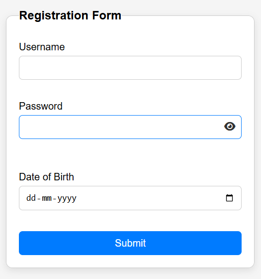
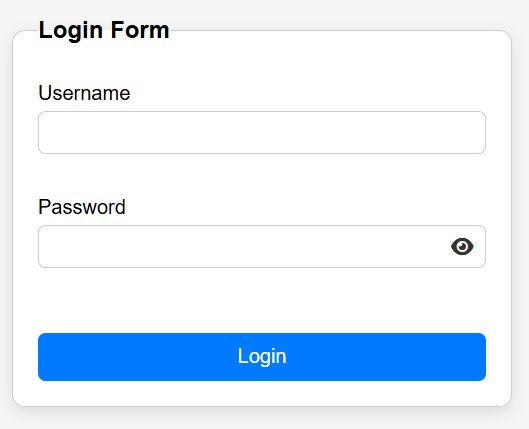
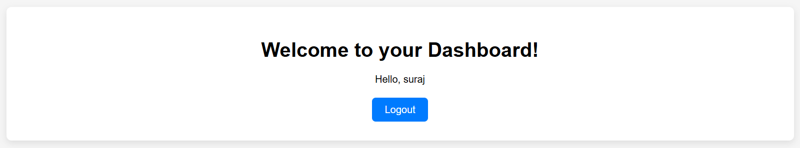

# Simple Login System
A simple web application for user registration and login, supporting multiple users. It stores user data in localStorage, allows for secure login/logout, and tracks login history. Built using HTML, CSS, and JavaScript.

## Features

- **User Registration**: Allows users to register with their username, dob, and password.
- **User Login**: Allows users to log in with their username and password.
- **Welcome Page**: Displays a welcome message after a successful login.
- **Validation**: Includes basic validation for registration and login forms.

## Technologies Used

- HTML
- CSS
- JavaScript

## Installation

1. Clone the repository:
   ```bash
   git clone https://github.com/suraj1821/simple-login-system.git
2. Open the project folder in your preferred text editor (e.g., VS Code).
3. Open index.html in a web browser to view the login system.

## Usage
- To register a new user, fill in the registration form with a name, dob, and password, then click Register.
- To log in, use the registered email and password, then click Login.
- After logging in, you'll be redirected to the home page with a welcome message.

## Screenshot

<p align="center">  
 
 </p>


## License
This project is open-source and available under the MIT License.


